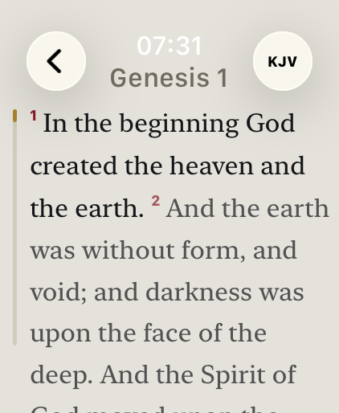
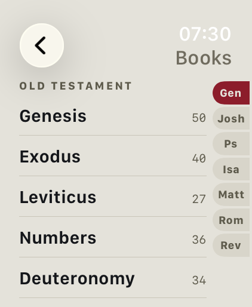
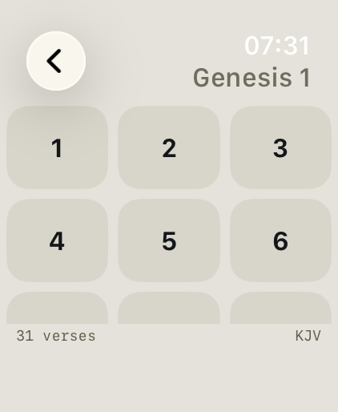

# Watch Bible

A standalone Bible app for the Apple Watch. Twelve translations in eight languages ship as a read-only SQLite file inside the app bundle — no iPhone, no account, no network, no data collection.

<p>
  
  
  
  
</p>

## What it does

- **Random verse** — one per page, tap or swipe to advance; from the whole Bible or from 463 curated key verses, with the last twenty remembered and not repeated.
- **26 topics** — comfort, hope, forgiveness, discipleship and others, drawn from those same 463 verses.
- **Look-up** — book → chapter → verse, with an index in the book list and three-column grids for chapters and verses.
- **Reading view** — the whole chapter as running text with superscript verse numbers, the way it is set in print. The Digital Crown scrolls, and you page on chapter by chapter across book boundaries. The last place read is offered on the home screen.
- **Verse of the day** — a complication for the Smart Stack and watch faces, holding from midnight to midnight.
- **Day and night palettes**, switched manually or by time of day, three text sizes, haptics.

The interface follows the watch's system language and falls back to English. Book names and abbreviations follow it too, each in the set customary for that language, and so does the reference separator: «Johannes 3,16» in German, "John 3:16" everywhere else. The Bible follows along as long as you leave it alone — the first translation of the display language — and stops following the moment you pick one yourself.

## Translations

| Abbr. | Translation | Language | Verses | Rights |
|---|---|---|---:|---|
| ELB | Elberfelder 1905 | German | 31,103 | public domain |
| SCH | Schlachter 1951 | German | 31,172 | CC BY 4.0, © 1951 Genfer Bibelgesellschaft |
| LUT | Luther 1912 | German | 31,171 | public domain |
| KJV | King James Version | English | 31,102 | public domain outside the United Kingdom |
| DAR | Darby Bible | English | 30,996 | public domain |
| BSB | Berean Standard Bible | English | 31,084 | public domain since 30 April 2023 |
| RVR | Reina-Valera 1909 | Spanish | 31,102 | public domain |
| LSG | Louis Segond 1910 | French | 31,102 | public domain |
| RIV | Riveduta 1927 | Italian | 31,102 | public domain |
| BLV | Bíblia Livre | Portuguese | 31,102 | CC BY 4.0, © 2018 Diego Santos, Mario Sérgio, Marco Teles |
| CUV | 和合本（繁體） | Chinese, traditional | 31,101 | public domain, term expired |
| CUVS | 和合本（简体） | Chinese, simplified | 31,101 | public domain, converted from CUV (OpenCC) |

66 books, 1,189 chapters, 373,238 verses, 61.5 MB. Copyrighted translations are deliberately absent. Where each text comes from, how it was verified and why that particular edition was chosen over the obvious alternative beside it: **[docs/Bibeltexte.md](docs/Bibeltexte.md)**.

## Versification

Translations count differently, and it is not only psalm headings — **whole chapter boundaries shift.** Numbers 16 has 35 verses in Schlachter and 50 in the King James, so the reference 4Mo 17,2 shows a different text in each. Both chapters open with "And the LORD spake unto Moses", which means the mistake is invisible at verse 1. The dividing line does not follow language, either: Elberfelder and King James count alike here, Schlachter and Luther differently.

So the app never pretends the place is the same. `BibleRepository.resolve` returns `.exact`, `.divergent`, `.clamped` or `.unavailable`, and **every case but `.exact` is shown** — a two-row table of both chapters' verse counts, plus a line when a verse had to be clamped. Two numbers explain the situation completely, so there is no warning colour and nothing to dismiss.

The Verse of the day goes through the same check. The complication shows the verse in the display language's first translation, the app opens it in the one you chose, and the link carries which translation the complication used, so the reading view resolves the reference and shows the table when the numbering differs.

## Privacy

Nothing is collected: no network code, no account, no analytics, no permission prompts, no App Group. Your settings and reading position stay in `UserDefaults` on the watch. The privacy manifest has exactly one entry (`NSPrivacyAccessedAPICategoryUserDefaults`, reason CA92.1). Full statement in eight languages: [docs/Privacy.md](docs/Privacy.md).

## Technical notes

- Swift 6, SwiftUI, watchOS 11.2. No UIKit, no storyboard, and **no external dependencies** — SQLite is used directly through `import SQLite3`, because the widget extension needs the same access.
- The database is opened once at launch, read-only, with cached prepared statements. Queries run off the main actor and return `Sendable` structs.
- **No `ORDER BY RANDOM()`:** `verse.id` is gapless and contiguous per translation, so a random verse is a single primary-key lookup. `chapter_meta` is precomputed, so the selection grids need no `COUNT` queries.
- **Nothing is hardcoded:** which translations, books and topics exist is read from the database at runtime, book names and abbreviations included. Remove a translation and the app keeps working without a code change. Topic names and rights lines are the exception and live in the string catalog — the database says what there is, the catalog how it is written.
- 45 unit tests (Swift Testing) cover the data layer, versification, languages, topics and chapter paging against `test_fixtures.json`, plus the widget's deep link.
- A watchOS app must stay under **75 MB uncompressed**, and this one is almost entirely database. Archived it comes to 62.2 MB — room for about two more translations. The widget reads the database out of the app bundle rather than shipping a second copy.

## Building and testing

```bash
xcodebuild -project "Watch Bible.xcodeproj" \
           -scheme "Watch Bible Watch App" \
           -destination 'generic/platform=watchOS Simulator' \
           -derivedDataPath "$HOME/Library/Developer/WatchBible-build" \
           -quiet build 2>&1 | grep -E "error:|warning:|BUILD"
```

Tests need a concrete simulator rather than `generic`:

```bash
xcodebuild -project "Watch Bible.xcodeproj" \
           -scheme "Watch Bible Watch App" \
           -destination 'platform=watchOS Simulator,name=Apple Watch Ultra 3 (49mm)' \
           -derivedDataPath "$HOME/Library/Developer/WatchBible-build" \
           test 2>&1 | grep -E "error:|failed|passed"
```

The build number sets itself: a final build phase writes a `YYYYMMDDHHMM` timestamp into `Config/Version.xcconfig`, the base configuration of both project configurations, and every target reads `CURRENT_PROJECT_VERSION` from it. Only that file is ever written, never `project.pbxproj` — [docs/Migration.md](docs/Migration.md) records what happens otherwise. During archiving the script deliberately skips, so the archive carries the number of the last ordinary build; press ⌘B first if you want a fresh one.

## The database

`Watch Bible Watch App/Resources/bible.sqlite` is the artifact of record: never edited by hand, and maintained in place rather than rebuilt. A full converter run would assign `translation.id` from `TRANSLATION_ORDER` instead of the original source order and so swap the `verse.id` blocks of King James and Darby — and `test_fixtures.json` pins exactly those blocks. Appending leaves every existing id untouched.

The scripts in `tools/` do that appending, and all of them read their tables from `tools/tables.py`, so canon knowledge, book names and abbreviations are listed once:

```bash
python3 tools/add_translation.py "Watch Bible Watch App/Resources/bible.sqlite" \
        --usfm riv=./ita1927 --usfm blivre=./porbr2018 --swiss
python3 tools/add_book_names.py "Watch Bible Watch App/Resources/bible.sqlite"
```

Every script understands `--check`: verify without writing. The whole procedure is written out in [docs/Bibeltexte.md](docs/Bibeltexte.md) under «Eine Übersetzung dazunehmen».

## Documentation

The documents below are written in German.

| File | Contents |
|---|---|
| [docs/Architektur.md](docs/Architektur.md) | Data model, schema, the queries, versification, structure of the app, the converter |
| [docs/Designspezifikation.md](docs/Designspezifikation.md) | Colours, typography, geometry, every screen, multilingual behaviour |
| [docs/Bibeltexte.md](docs/Bibeltexte.md) | Provenance, verification and licence of each individual translation |
| [docs/Migration.md](docs/Migration.md) | How the prototype became today's app — finished, kept as a record |
| [docs/Privacy.md](docs/Privacy.md) | Privacy policy, in English and the app's other seven languages |

## Licence

The code is licensed under the **GNU General Public License v3.0** (see [LICENSE](LICENSE)).

The Bible texts are **not** covered by that licence. Each translation carries its own rights situation; the table above names them and `docs/Bibeltexte.md` substantiates them. In the app, every translation's rights line appears in the credits in the interface language, with the rights holder and the licence name left verbatim — mandatory for Schlachter 1951 and Bíblia Livre, both CC BY 4.0.
