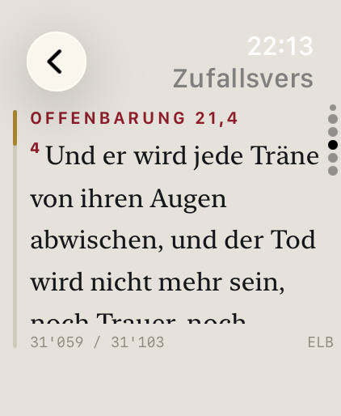
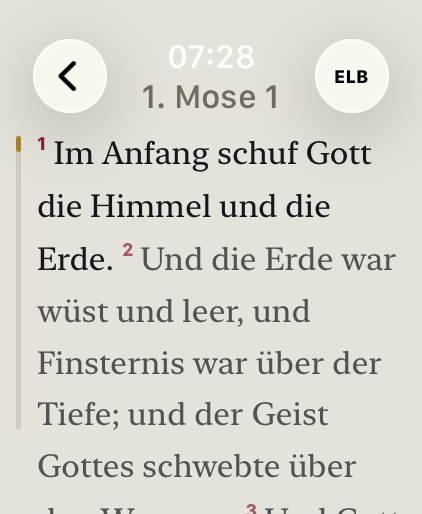
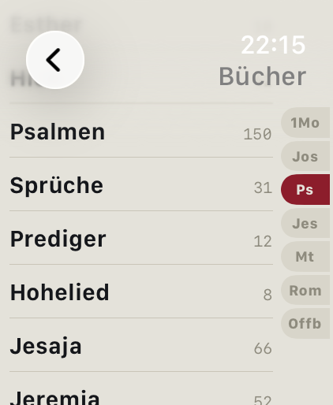
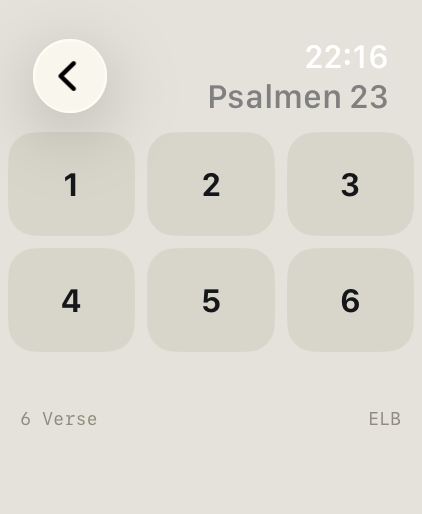

# Watch Bible

A standalone Bible app for the Apple Watch. Twelve translations in eight languages ship as a read-only SQLite file inside the app bundle — no iPhone required, no account, no network, no data collection.

<p>
  
  
  
  
</p>

> **A note on language.** German is this project's source language: the string catalog is authored in German, book names and topic keys are stored in German in the data model, and the documents under `docs/` are written in German. The app's interface, however, follows the watch's system language across all six supported languages and falls back to **English** when the system language is none of them. The screenshots above show the German interface.

## What the app does

**Random verse.** One verse per page; swipe up or tap anywhere to advance, with haptic feedback. Either evenly distributed across the whole Bible or drawn from 463 curated key verses. The last twenty verses are remembered and not repeated. Tapping the reference opens the surrounding chapter.

**Topics.** The same 463 verses, arranged into 26 topics — comfort, hope, discipleship, forgiveness and others. Tapping one opens the random verse view restricted to that topic.

**Look-up.** Book → chapter → verse. The book list carries an index with seven jump marks; chapters and verses appear in a three-column grid. Verses that do not exist in a chapter stay visible but dimmed, so the boundary of the chapter is something you can see rather than something that is merely missing.

**Reading view.** The whole chapter as running text with superscript verse numbers, the way it is set in print. The selected verse at full opacity, the rest dimmed. The Digital Crown scrolls, and a ribbon on the left tracks the position. The last place read is remembered and offered on the home screen as "continue reading".

**Switch translation without losing your place** — and without silently showing the wrong one (see [Versification](#versification)).

**Verse of the day as a complication.** A widget for the Smart Stack and watch faces (`accessoryRectangular` and `accessoryCircular`). The verse holds from midnight to midnight; tapping it opens the app at that verse.

**Day and night.** Paper by day, black by night, switched manually or automatically between two times you set yourself. With the wrist down (`isLuminanceReduced`) it always uses the night palette.

**Settings.** Translation, random mode, appearance, text size, haptics, credits.

## Bible translations and licences

Every text shipped is either in the public domain or freely licensed. Each translation's copyright line lives in the database, which is why it appears in the app's credits screen by itself.

| Abbr. | Translation | Language | Verses | Rights |
|---|---|---|---:|---|
| ELB | Elberfelder 1905 | German | 31,103 | public domain |
| SCH | Schlachter 1951 | German | 31,172 | CC BY 4.0, © 1951 Genfer Bibelgesellschaft |
| LUT | Luther 1912 | German | 31,171 | public domain |
| KJV | King James Version | English | 31,102 | public domain outside the United Kingdom |
| DAR | Darby Bible | English | 30,996 | public domain |
| BSB | Berean Standard Bible | English | 31,084 | public domain since 30 April 2023 |
| RVR | Reina-Valera 1909 | Spanish | 31,102 | public domain |
| LSG | Louis Segond 1910 | French | 31,102 | public domain |
| RIV | Riveduta 1927 | Italian | 31,102 | public domain |
| BLV | Bíblia Livre | Portuguese | 31,102 | CC BY 4.0, © 2018 Diego Santos, Mario Sérgio, Marco Teles |
| CUV | 和合本（繁體） | Chinese, traditional | 31,101 | public domain, term expired |
| CUVS | 和合本（简体） | Chinese, simplified | 31,101 | public domain, converted from CUV (OpenCC) |

66 books, 1,189 chapters, 373,238 verses, 61.5 MB. Where each text comes from, how it was verified and which edits to the source are documented is recorded in **[docs/Bibeltexte.md](docs/Bibeltexte.md)** (in German) — including why each particular edition was chosen over the obvious alternative next to it.

Copyrighted translations are deliberately absent. Schlachter 2000 can be added with written permission from the Genfer Bibelgesellschaft; that takes a converter flag, not a code change.

## Languages

The interface exists in every language for which a Bible translation ships: **German, English, Spanish, French, Italian, Portuguese, Chinese (traditional) and Chinese (simplified).** It follows the system language; there is no separate language setting. A unit test keeps the two sets identical in both directions — add a translation in a ninth language without translating the interface and the build goes red.

More than the labels is translated:

- **Book names and abbreviations** come from the database, each in the set customary for that language — Elberfelder for German, the SBL Handbook of Style for English, Reina-Valera for Spanish, Segond for French, the CEI set for Italian, the Almeida set for Portuguese, the 和合本 set for Chinese. The book list's index shows them: 1Mo · Jos · Ps · Jes · Mt · Röm · Offb in German, Gen · Josh · Ps · Isa · Matt · Rom · Rev in English, 創 · 書 · 詩 · 賽 · 太 · 羅 · 啟 in Chinese.
- **The reference format itself.** German Bibles write «Johannes 3,16», every other language in the app "John 3:16".
- **Numbers follow the region, not the language:** 18’463 in Switzerland, 18,463 in the United States.
- **Chinese needs more room:** larger type, tighter leading, no forced serif design.

On first launch the app picks the first translation of the display language in database order. Never again after that: a translation you have chosen is not overwritten when the system language changes.

## Versification

Bible translations count differently, and it is not only about psalm headings — **whole chapter boundaries shift.** In Numbers, chapter 16 has 35 verses in Schlachter and 50 in the King James; the reference 4Mo 17,2 accordingly shows a different text in each. Because both chapters open with "And the LORD spake unto Moses", verse 1 looks identical — the error only becomes visible from verse 2 on. The dividing line does not follow language, either: Elberfelder and King James count alike here, Schlachter and Luther differently.

So the app does not pretend it is the same place when you switch translations. `BibleRepository.resolve` returns `.exact`, `.divergent`, `.clamped` or `.unavailable`, and **every case but `.exact` is shown**: a two-row table with both chapters' verse counts, plus one more line when a verse had to be clamped. No warning colour, no icon, nothing to dismiss — two numbers explain the situation completely.

## Privacy

The app collects nothing. No network APIs, no account, no analytics, no permission prompts, no App Group. The only thing stored is your own settings, in `UserDefaults` on the device. The privacy manifest has exactly one entry (`NSPrivacyAccessedAPICategoryUserDefaults`, reason CA92.1).

## Technical notes

- **Swift 6, SwiftUI, watchOS 11.2.** No UIKit, no WatchKit storyboard.
- **No external dependencies.** SQLite is used directly through `import SQLite3` — the widget extension needs the same access, and SPM packages are known to cause trouble there.
- The database is **opened once at launch, read-only** (`SQLITE_OPEN_READONLY`), and prepared statements are cached. Queries run off the main actor; return values are `Sendable` structs.
- **No `ORDER BY RANDOM()`:** `verse.id` is gapless and contiguous per translation, so a random verse is a single primary-key lookup. `chapter_meta` is precomputed, so the selection grids need no `COUNT` queries.
- **Nothing is hardcoded:** translations, books, book names, abbreviations, topics and copyright lines are read from the database at runtime. Remove a translation and the app keeps working without a code change.
- **34 unit tests** (Swift Testing) cover the data layer, versification, languages, topics and chapter paging against `test_fixtures.json`.

Architecture, schema and the queries in detail: **[docs/Architektur.md](docs/Architektur.md)**. Colours, typography, grid geometry and the behaviour of every screen: **[docs/Designspezifikation.md](docs/Designspezifikation.md)**. Both are in German.

## Project layout

```
Watch Bible.xcodeproj
├── Watch Bible/                      iOS container (empty shell, watchOS-only app)
├── Watch Bible Watch App/            the app
│   ├── Data/                         SQLite access, repository, models
│   ├── Features/                     Home · Random · Topics · Lookup · Reader · Settings
│   ├── Shared/                       AppModel, AppSettings, Localization, Theme
│   ├── Resources/                    bible.sqlite, string catalogs
│   ├── Assets.xcassets/              two colorsets per role (Day/Night)
│   └── PrivacyInfo.xcprivacy
├── BibelWatchWidget/                 verse of the day
├── Watch Bible Watch AppTests/       unit tests + test_fixtures.json
├── Config/Version.xcconfig           build number, written during the build
├── tools/                            converter and top-up scripts (Python)
├── AppStore/                         screenshots
└── docs/                             architecture, design, Bible texts, migration
```

Five targets: the iOS container, the watch app, the widget, unit tests and UI tests.

## Building and testing

```bash
xcodebuild -project "Watch Bible.xcodeproj" \
           -scheme "Watch Bible Watch App" \
           -destination 'generic/platform=watchOS Simulator' \
           -derivedDataPath "$HOME/Library/Developer/WatchBible-build" \
           -quiet build 2>&1 | grep -E "error:|warning:|BUILD"
```

Tests need a concrete simulator rather than `generic`:

```bash
xcrun simctl list devices available | grep -i watch     # look up the names

xcodebuild -project "Watch Bible.xcodeproj" \
           -scheme "Watch Bible Watch App" \
           -destination 'platform=watchOS Simulator,name=Apple Watch Ultra 3 (49mm)' \
           -derivedDataPath "$HOME/Library/Developer/WatchBible-build" \
           test 2>&1 | grep -E "error:|failed|passed"
```

Things worth knowing:

- If `xcode-select -p` points at the CommandLineTools rather than Xcode, prefix the command with `DEVELOPER_DIR=/Applications/Xcode.app/Contents/Developer`.
- **Never put derived data inside the project folder.** If the directory is synchronised by a file provider (OneDrive, iCloud Drive, `~/Documents` too), it attaches extended attributes to the build products and codesign fails with "resource fork, Finder information, or similar detritus not allowed".
- A successful build says nothing about layout. Look at the screens in the simulator — day and night, and at least once in Chinese.
- The path contains spaces, so quote it in every command.
- **Watch the bundle size.** A watchOS app must stay under 75 MB uncompressed, and this one is mostly database. Measure after archiving, not before:

  ```bash
  xcodebuild -project "Watch Bible.xcodeproj" -scheme "Watch Bible Watch App" \
             -destination 'generic/platform=watchOS' \
             -archivePath "$HOME/Library/Developer/WatchBible-archive" \
             -derivedDataPath "$HOME/Library/Developer/WatchBible-build" archive

  du -sh "$HOME/Library/Developer/WatchBible-archive.xcarchive/Products/Applications/"\
"Watch Bible.app/Watch/Watch Bible Watch App.app"
  ```

  With twelve translations that comes to **62.2 MB**, leaving about 12 MB of headroom — roughly two more translations. The database appears exactly once in the package; the widget reads it out of the app bundle rather than shipping its own copy.

### The build number sets itself

The "Watch Bible Watch App" target has a final build phase, "Set Build Number". It writes the current timestamp in the form `YYYYMMDDHHMM` as `BUILD_TIMESTAMP` into `Config/Version.xcconfig`. That file is the base configuration of both project configurations; every target sets `CURRENT_PROJECT_VERSION = $(BUILD_TIMESTAMP)` and so stays on the same number automatically.

Four points about it:

- **Only the xcconfig is written, never `project.pbxproj`.** That is the whole reason for this arrangement: changing the project file makes Xcode reload the project mid-run and abort whatever is in progress — no error, no message. The earlier version called `xcrun agvtool new-version` and failed exactly there: every test run started from Xcode (⌘U) aborted after the build without executing a single test. The same run passed from the command line, because `xcodebuild` does not reload projects.
- **During archiving the script deliberately does not run** (it checks for `$ACTION = install` and exits). The archive therefore carries the number of the last ordinary build; press ⌘B first if you want a fresh one before uploading.
- The timestamp only takes effect in the **next** build, because Xcode resolves build settings at the start. That is fine for the App Store — the number increases monotonically.
- `Config/Version.xcconfig` **belongs in the repository** — without it `CURRENT_PROJECT_VERSION` is empty. The price is that every build changes that one line, so `git status` always shows it as modified. `ENABLE_USER_SCRIPT_SANDBOXING` is set to `NO` for this one target, because the sandbox forbids writing into the project directory.

## The database

`Watch Bible Watch App/Resources/bible.sqlite` is **not edited by hand.** If something about its contents is wrong, the script in `tools/` is adjusted and the file regenerated.

| Tool | Purpose |
|---|---|
| `tools/quotepas_to_sqlite.py` | The converter. Reads the LaTeX source file plus OSIS XML (`--osis CODE=FILE`) and USFM directories (`--usfm CODE=DIR`), and writes the database. Standard library only. |
| `tools/tables.py` | The lookup tables: canon knowledge, book names and abbreviations for all eight languages, `TRANSLATION_ORDER`, copyright lines, schema version. Both the converter **and** the top-up scripts import from here — one source. The `book` table's language columns are derived from these dictionaries, never listed a second time. |
| `tools/add_book_names.py` | Adds book names and abbreviations to an existing database. `--check-zh` verifies the simplified characters against the mapping derived from CUV/CUVS themselves. |
| `tools/add_translation.py` | Appends a translation to an existing database without rewriting the ones already in it. This is how Italian and Portuguese were added — see the note on verse ids below. |
| `tools/reorder_translations.py` | Sets `translation.sort_order` from `TRANSLATION_ORDER` — and with it the default translation per language. |
| `tools/update_curated.py` | Adds key verses and topics. Checks every reference against the master translation and writes nothing while a single one is missing. |

All top-up scripts understand `--check`: verify without writing.

This is how the shipped file is produced:

```bash
python3 tools/quotepas_to_sqlite.py bible.db \
        --osis sch1951=sch1951.xml --osis lut=luth1912.xml \
        --osis cuv=chi.xml --osis cuvs=cuv_simplified.xml \
        --osis rvr1909=sparv.xml --osis lsg=fren.xml \
        --usfm bsb=./bsb_usfm --usfm riv=./ita1927 --usfm blivre=./porbr2018 \
        --exclude slt --curated tools/curated_verses.json --swiss \
        -o "Watch Bible Watch App/Resources/bible.sqlite"
```

The file actually shipped was not built that way, though. Italian and Portuguese were **appended** to the existing database with `add_translation.py`:

```bash
python3 tools/add_translation.py "Watch Bible Watch App/Resources/bible.sqlite" \
        --usfm riv=./ita1927 --usfm blivre=./porbr2018 --swiss
python3 tools/add_book_names.py "Watch Bible Watch App/Resources/bible.sqlite"
```

The reason is `translation.id`. The shipped database still carries the ids from the original source order, where DAR came before KJV; a full converter run assigns ids from `TRANSLATION_ORDER` instead and would swap the `verse.id` blocks of those two translations — and `test_fixtures.json` pins exactly those blocks. Appending leaves everything existing untouched: the new translations take the next free id and a verse block after the last one in use.

The third-party source files — the quotepas file `bible.db`, the OSIS editions and the USFM directory — are not in this repository; where they come from is documented in [docs/Bibeltexte.md](docs/Bibeltexte.md). What was produced here is included: `tools/cuv_simplified.xml` (generated from the traditional edition) and `tools/curated_verses.json`.

**The order of the source arguments determines `translation.id` and the `verse.id` ranges.** Moving them moves every verse that follows — the app reads both at runtime, but `test_fixtures.json` then has to be recomputed. The **display order**, by contrast, lives in `TRANSLATION_ORDER` and can be changed afterwards with `reorder_translations.py` without touching the verse table; `id` and `sort_order` then diverge (KJV has `id` 3 and `sort_order` 2), and the app reads `ORDER BY sort_order` exclusively.

## Documentation

The documents below are written in German.

| File | Contents |
|---|---|
| [docs/Architektur.md](docs/Architektur.md) | Data model, schema, the queries, versification, structure of the app, the converter |
| [docs/Designspezifikation.md](docs/Designspezifikation.md) | Colours, typography, geometry, every screen, multilingual behaviour |
| [docs/Bibeltexte.md](docs/Bibeltexte.md) | Provenance, verification and licence of each individual translation |
| [docs/Migration.md](docs/Migration.md) | How the prototype became today's app — finished, kept as a record |
| [CLAUDE.md](CLAUDE.md) | Project instructions for working with Claude Code |

## Licence

The code is licensed under the **GNU General Public License v3.0** (see [LICENSE](LICENSE)).

The Bible texts are **not** covered by that licence. Each translation carries its own rights situation; the table above names them, `docs/Bibeltexte.md` substantiates them, and each translation's copyright line is stored in the database and shown in the app's credits. For Schlachter 1951 (CC BY 4.0) attribution is mandatory — and is provided there.
